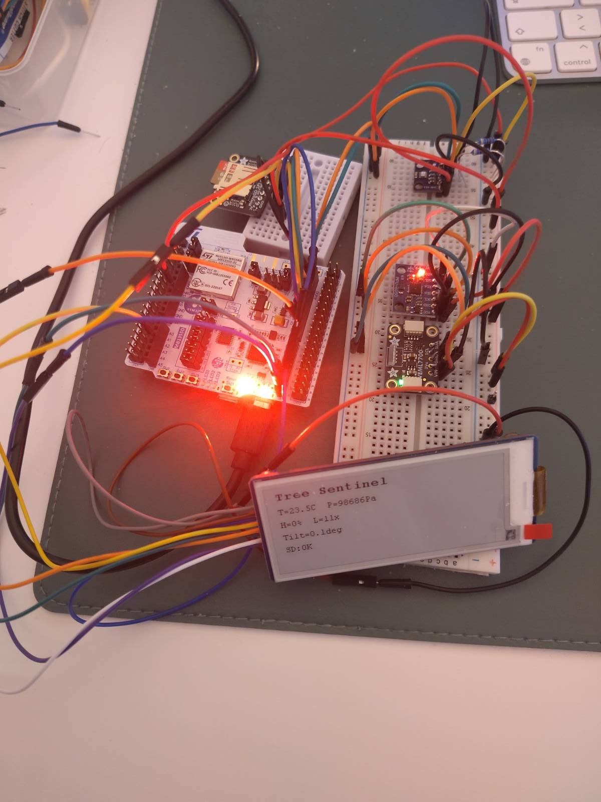

# Testing Sensors on STM32WB55RG + 2.9" E-Paper Display


Reads BME280 (T/P/H), MPU-6050 (accel), and VEML7700 (lux) sensors over I2C1 and displays readings on a Waveshare 2.9" V2 e-paper display (SPI1), updating every 2 seconds.

## Quick Start

```bash
cd build
cmake .. -G "Unix Makefiles" -DCMAKE_TOOLCHAIN_FILE=../cmake/arm-none-eabi-gcc.cmake
make -j$(nproc)
# Flash build/bme280.elf with ST-Link/OpenOCD
```

## Pin Connections

E-Paper Display (EPD)
```
| Display   | Nucleo     |
|-----------|------------|
| VCC       | 3V3        |
| GND       | GND        |
| DIN/MOSI  | PA7 (D11)  |
| CLK/SCK   | PA5 (D13)  |
| CS        | PA9 (D9)   |
| DC        | PA2 (D1)   |
| RST       | PA1 (A2)   |
| BUSY      | PA3 (D0)   |
````

SD Card
```
| SD Card | NUCLEO-WB55RG |
|---------|---------------|
| CLK     | PA5 (D13)     |
| MOSI    | PA7 (D11)     |
| MISO    | PA6 (D12)     |
| CS      | PA4 (D10)     | configured HIGH
| VCC     | 3V3           |
| GND     | GND           |
```

I2C Sensors (shared bus on I2C1)
```
| Sensor     | I2C Addr | VCC  | SCL      | SDA      | GND |
|------------|----------|------|----------|----------|-----|
| BME280     | 0x76     | 3V3  | PB8 (D15)| PB9 (D14)| GND |
| MPU-6050   | 0x68     | 3V3  | PB8 (D15)| PB9 (D14)| GND |
| VEML7700   | 0x10     | 3V3  | PB8 (D15)| PB9 (D14)| GND |
| SHT40      | 0x44     | 3V3  | PB8 (D15)| PB9 (D14)| GND |
```
All sensors are 3.3V logic, 4.7kΩ pull-ups on SDA/SCL (on-board or external). ADDR pins: BME280 SDO=GND selects 0x76; MPU-6050 AD0=GND selects 0x68.

## Display Layout

```
Testing sensors....
T:24.5C H:45.2%
P:101325 Pa
ACC 12 -4 256
LUX 320.0
```

## Configuring Intervals

Interval timing is in `Core/Src/main.c`:

| Variable              | Location                   | Default | Purpose                |
|-----------------------|----------------------------|---------|------------------------|
| `#define SAMPLE_INTERVAL` | near top of file          | 2000 ms | Sensor + display + log (currently one interval for everything) |
| `meas_interval`       | planned `static uint32_t`  | 10000   | Future: sensor read + SD log only |
| `disp_interval`       | planned `static uint32_t`  | 60000   | Future: e-paper refresh only |

Currently `SAMPLE_INTERVAL` controls all three operations together. Planned: split into `meas_interval` and `disp_interval` with independent timers so the display updates less often than the sensor log.

## Known Bugs

### Wrong file date on SD card
CSV files created on the SD card show `1970-01-01` when viewed on a PC. This happens because `get_fattime()` is not implemented — the STM32WB55 has no battery-backed RTC, so FatFS writes a zero timestamp (FAT epoch = 1980, but some OSes interpret it as Unix epoch 1970). **Not a data integrity issue**, only cosmetic. Fix would require an external RTC module or setting time via BLE.

### CSV timestamps use compile time as base
The `datetime` column is computed as `compile_time + HAL_GetTick()/1000` in `SENSORS/data_logger.c`. It will drift slightly over long uptimes (MCU clock tolerance). Once BLE sets a real epoch via `LOG_SetEpoch()`, this becomes fully accurate.

## Key Files

- `Core/Src/main.c` — main loop, sensor reads, display update
- `EPD/minimal_display.c` — 5-line display helper using `EPD_2IN9_V2_Display_Base`
- `EPD/EPD_2in9_V2.c` — Waveshare 2.9" V2 e-paper driver
- `SENSORS/` — BME280, MPU-6050, VEML7700 drivers
